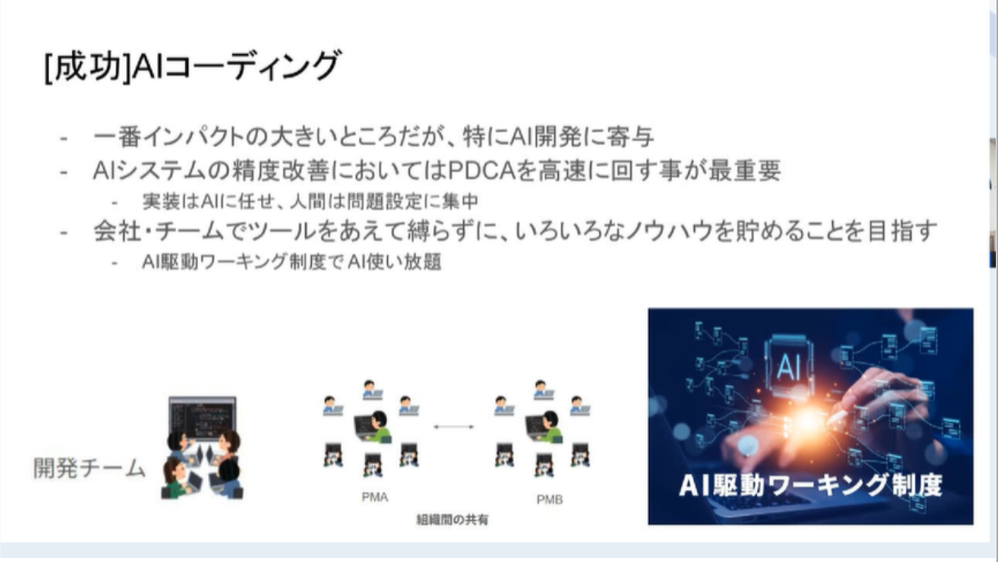
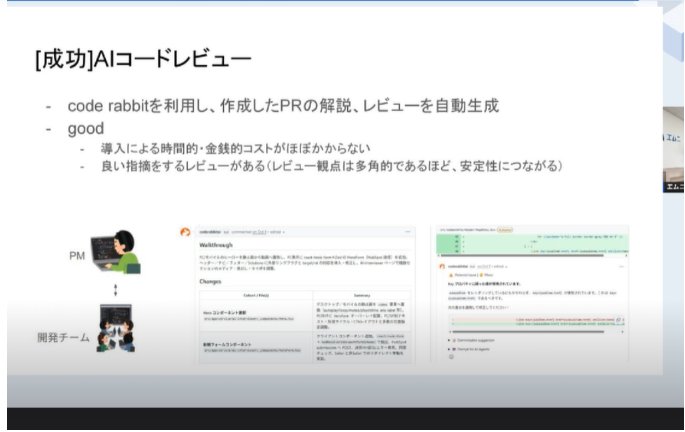
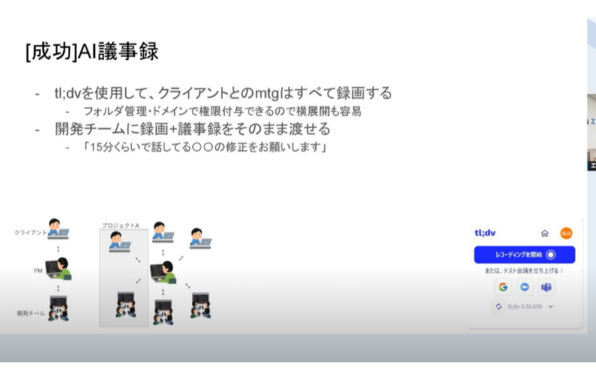
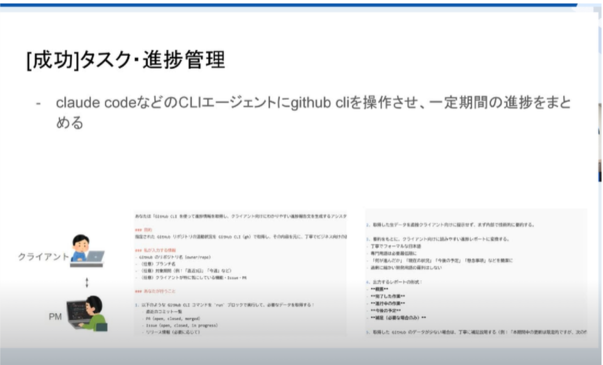
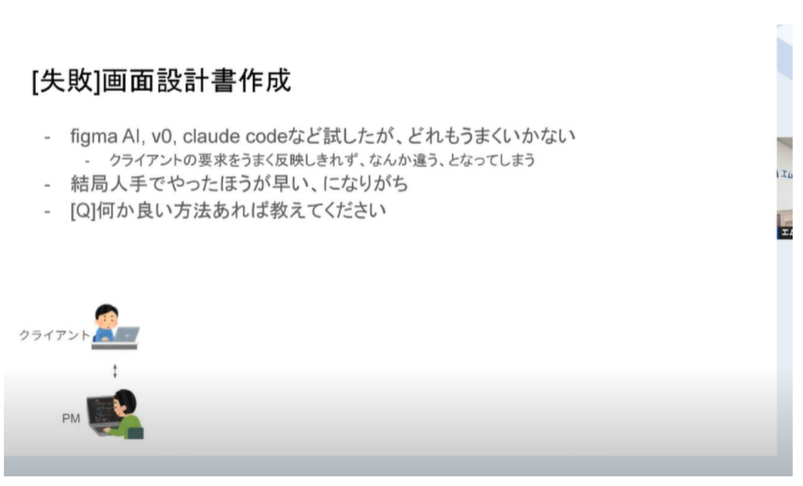
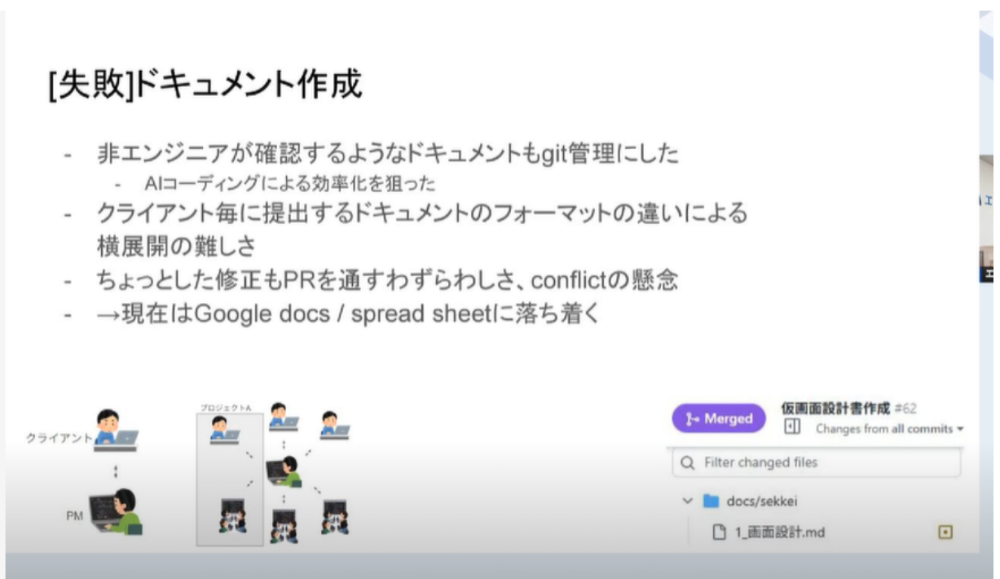

参考資料
20251202 Findyセミナーの発表資料
https://speakerdeck.com/resilire/2025-joblt-findy-deng-tan-zi-liao
DDD
https://speakerdeck.com/dip_tech/aiqu-dong-kai-fa-niyorudddnoshi-jian
AIエージェントを活かすPM術 AI駆動開発の現場から
以下の取り組みいいかも

これもいいかも

メモ
暗黙知を形式知に変えるフレームワーク
RDRA
SECIモデル
