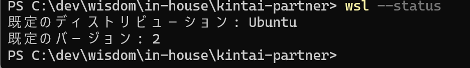

# システム要件の確認

Windows 版の要件:Windows 10 64-bit: Pro, Enterprise,
Education(Build 19041 以上)-WSL2 が有効 4GB 以上のメモ
リ - BIOS レベルでの仮想化が有効

## WSL2 が有効か確認する

WSL の現在の状態を表示します

```
wsl --status
```

有効な場合


以下で動確
docker run -p 8080:80 nginx
⇒ 起動できた

停止する
docker stop コンテナ ID

コンテナ削除
docker rm コンテナ ID
