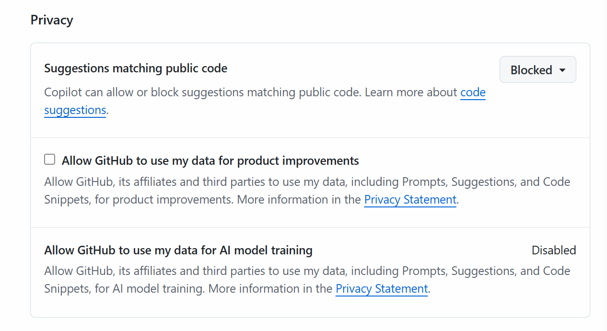
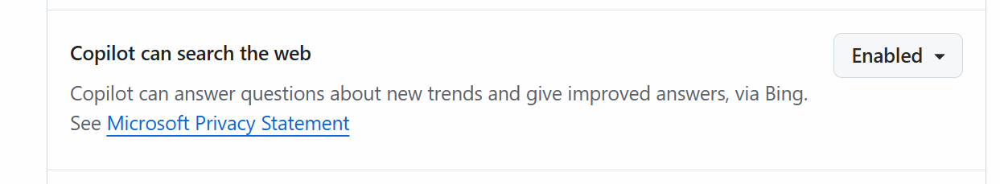

# GitHub Copilot

## setting

setting>copilot

### Privacy

以下の設定推奨


### Features



訳）
Copilot はウェブを検索できます
Copilot は Bing を介して新しいトレンドに関する質問に答え、改善された回答を提供できます。

### 有効化・無効化

不明

## GitHub Copilot Chat

- 対話形式でコーディングをサポートしてくれる
- 開発者向けの AI チャットボット
- 自然言語でコードの作成や修正を依頼すると、 AI が適切なコー
  ドや解決策を対話形式で提案してくれる。
- GitHub Copilot の有用版ユーザーは追加料金なしで利用で
  きる。 GitHub Copilot Free ユーザー向けに無料枠あり。

### tips

- @で参加者を選択
  https://docs.github.com/ja/copilot/reference/cheat-sheet?tool=vscode

- マークダウンで指示を出すとよりよい結果がでる
  以下、プロンプト例

```
# 概要
- 日本円 (JPY) 米ドル (USD) に変換する通貨換算アプリを、HTMLとJavaScriptを
使用して作成してください。
- デザインはシンプルで構いません。
- 外部ライブラリやAPIは使用せず、為替レートは固定値とします。

## 基本機能
- ユーザーが日本円 (JPY) を入力できるテキスト入力フォームを表示してください。
- 「変換」ボタンを押すと、 米ドル (USD) への変換結果を表示エリアに表示してください。
- 為替レートは固定で、1JPY=0.0067 USD としてください。
- 入力は数値のみ受け付け、 空欄や負の値などの無効な入力に対してはエラーメッセージを表示してください。

## ファイル構成
- index.html アプリのHTML構造を記述
- main.js 変換ロジックおよびイベント処理を記述
```
