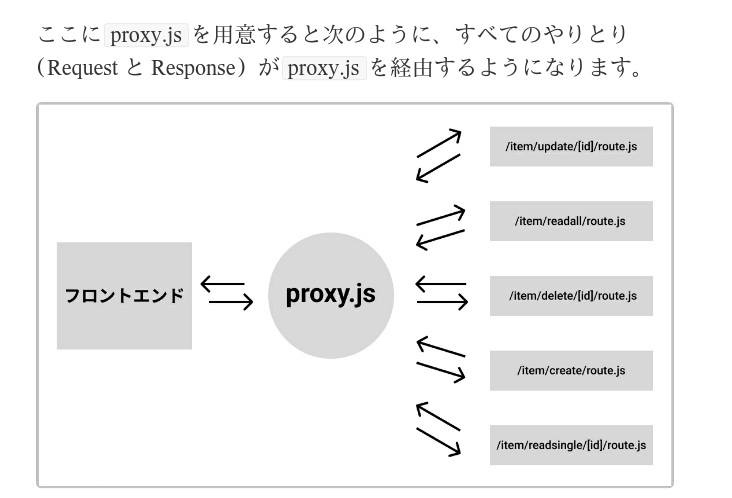

# ログイン状態を維持する仕組み

メジャーな方式

- セッション方式
- トークン方式

## トークン方式

初回ログイン時にサーバーがクライアントに対してトークンを発行。
そのトークンを以後のリクエストで毎回サーバへ送信。
サーバはそれをチェックすることでログイン状態が維持される。
トークン自体は文字と数字がランダムに並んだ文字列のこと。
この中にさまざまなデータを含ませることができ、有効期限などの情報もこの中に入る。
トークン方式でもっとも一般的なのは JSON Web Token (JWT)

**ちなみに、Next.js でログイン機能を開発する場合、多くは NextAuth パッケージを使用する**

# 基本的なログイン機能を実装する場合の１例

## JSON Web Token パッケージ

JSON Web Token パッケージを使い、ログインの際にトークンを発行する。

インストール

```
npm i jose
```

## jose の使用方法

・Sign JWT()　トークンを発行する
・jwtVerify()　ログイン後のリクエスト時にトークンの有効性を検証する

SignJWT() でトークン発行
トークンのアルゴリズムの種類や有効期限、ペイロード、シークレットキーなどの設定を行う
ペイロード(payload)とは、 トークンが含むことのできるデータを指し、一般的にはユーザー名やメールアドレスなどを入れる。
シークレットキーは、発行されたトークンの安全性を高めるために使われる。
具体的には、トークンだけを持っていてもトークンは有効とされず、シークレットキーと組み合わせる
ことで初めて有効と判定される。

まずは次のようにシークレットキー生成のコードを追加する。
new TextEncoder().encode() とは JavaScript のコードで、 文字
列をエンコード (他の形式に変換すること) する働きがあるので、
xxx-secret-key という文字列をトークン発行に使う
シークレットキーの形式に変換しています。

```
import { NextResponse } from "next/server";
import { SignJWT } from "jose";
import supabase from "../../../utils/database";

export async function POST(request) {
  const reqBody = await request.json();

  try {
    const { data, error } = await supabase
      .from("users")
      .select()
      .eq("email", reqBody.email)
      .single();

    if (!error) {
      // ユーザーデータが存在する場合の処理

      if (reqBody.password === data.password) {
        // パスワードが正しい場合の処理

		// トークン発行を発行するために、シークレットキーとペイロードを準備する
		// シークレットキーの生成
		// ※この場合、xxx-secret-keyという文字列をトークン発行に使うシークレットキーの形式に変化する
        const secretKey = new TextEncoder().encode("xxx-secret-key");

		// トークンに含ませるデータの指定
		// ※この場合は、メールアドレス
        const payload = {
          email: reqBody.email,
        };

		// SignJWT() でトークン発行
        const token = await new SignJWT(payload)
          .setProtectedHeader({ alg: "HS256" })	// アルゴリズム
          .setExpirationTime("1d")	// 有効期限
          .sign(secretKey);			// シークレットキー

        return NextResponse.json({ message: "ログイン成功", token: token });
        // return NextResponse.json({ message: "ログイン成功", data: data });
      } else {
        // パスワードが間違っている場合の処理
        return NextResponse.json({
          message: "ログイン失敗：パスワードが間違っています",
        });
      }
    } else {
      // ユーザーデータが存在しない場合の処理
      return NextResponse.json({
        message: "ログイン失敗：ユーザー登録をしてください",
      });
    }
  } catch {
    return NextResponse.json({ message: "ログイン失敗" });
  }
}
```

発行されたトークンの中のペイロードを確認する
https://jwt.io

このようにしてログインが成功した場合、
発行されたトークンがフロントエンドに送られる。
フロントエンドは送られてきたトークンをブラウザ内の Local Storage に保存し、
リクエストの都度、Local Storage からトークンを取り出してリクエストに含ませる。
それをバックエンド側で毎回チェックし、ユーザのログイン状態をチェックする。

※Local Storage は開発者ツールの Application>Local Storage>対象サイトで確認できる

# ログイン状態を判定する仕組み

ログイン状態を判定する機能は、アプリ内の複数の箇所で必要となる仕組み。
このようなケースでは、 Next.js の用意している Proxy という仕組みを使用する。

プロジェクトのルートフォルダと同じ階層に proxy.js ファイルを作成する。
(なお、Next.js バージョン 15 以前は middleware.js という名称で、
バージョン 16 から proxy.js に改称されました)。
※トップフォルダに作成された proxy.js は、そのプロジェクト全体に対して機能する。

以下のように、フロントエンドとバックエンドのすべてのやりとりが
proxy.js を経由するようになる。
よって、ユーザのログイン状態判定などは、proxy.js に書く。


proxy.js の中に、適用範囲を制限するコードを記述する。
（誰でも閲覧できるページなどは、適用除外とする）

続いて、フロントエンドからのリクエストにトークンが含まれているかを確認する
トークンがある場合は、トークンの有効性を判定する。t
トークンの判定には、jose の jwtVerify()とシークレットキーを使用。
