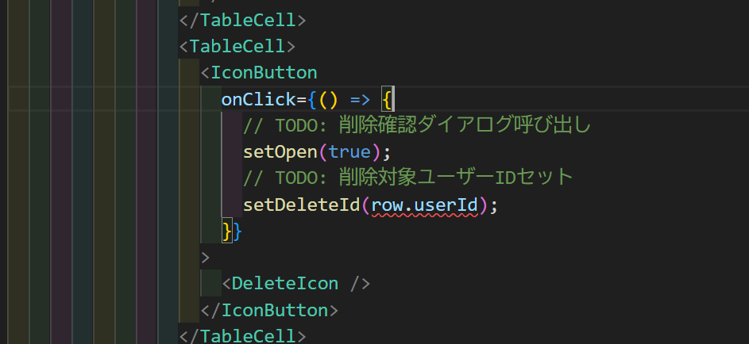

上記のコードの波線で以下ののエラー

型 'string | undefined' の引数を型 'SetStateAction<string>' のパラメーターに割り当てることはできません。
型 'undefined' を型 'SetStateAction<string>' に割り当てることはできません。

## 対応

`setDeleteId(row.userId);` で警告が出る理由を説明します。

**型の不一致が原因です:**

```tsx
// deleteIdの型定義
const [deleteId, setDeleteId] = useState<string>("");

// row.userIdの型(UserInfo型から推測)
row.userId; // string | undefined の可能性
```

**問題点:**

- `deleteId`は`string`型として定義されています
- しかし、`row.userId`は`string | undefined`型の可能性があります
- TypeScript は`undefined`を`string`型のステートに直接設定することを許可しないため、型エラーが発生します

**解決方法:**

1. **Null 合体演算子を使用(推奨):**

```tsx
setDeleteId(row.userId ?? "");
```

2. **論理 OR 演算子を使用:**

```tsx
setDeleteId(row.userId || "");
```

3. **型アサーション(非推奨):**

```tsx
setDeleteId(row.userId!); // userIdが必ず存在すると保証する場合のみ
```

`UserInfo`型の定義で`userId`がオプショナル(`userId?: string`)になっている場合、この警告が表示されます。フォールバック値として空文字列を提供することで、安全に処理できます。
