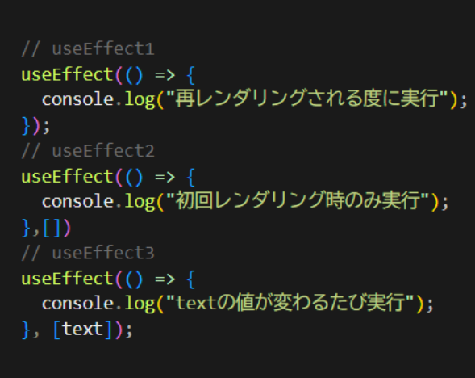

# useEffect

純粋なレンダリング以外の処理を「副作用」
useEffect はこの「副作用」を制御するための機能

useEffect の基本構文

```
import { useEffect } from "react";
useEffect(() => {
  処理
}, [依存配列]);

```

依存配列に値を設定した場合、その値が変更された場合に限り内部の処理が実行されます。
依存配列は必須ではなく、未指定の場合「再描画の度に内部の処理を実行」という動きになります。
また、依存配列に空配列を指定した場合は初回レンダリング時のみ処理が実行されます。
基本はこの３パターンになります。


