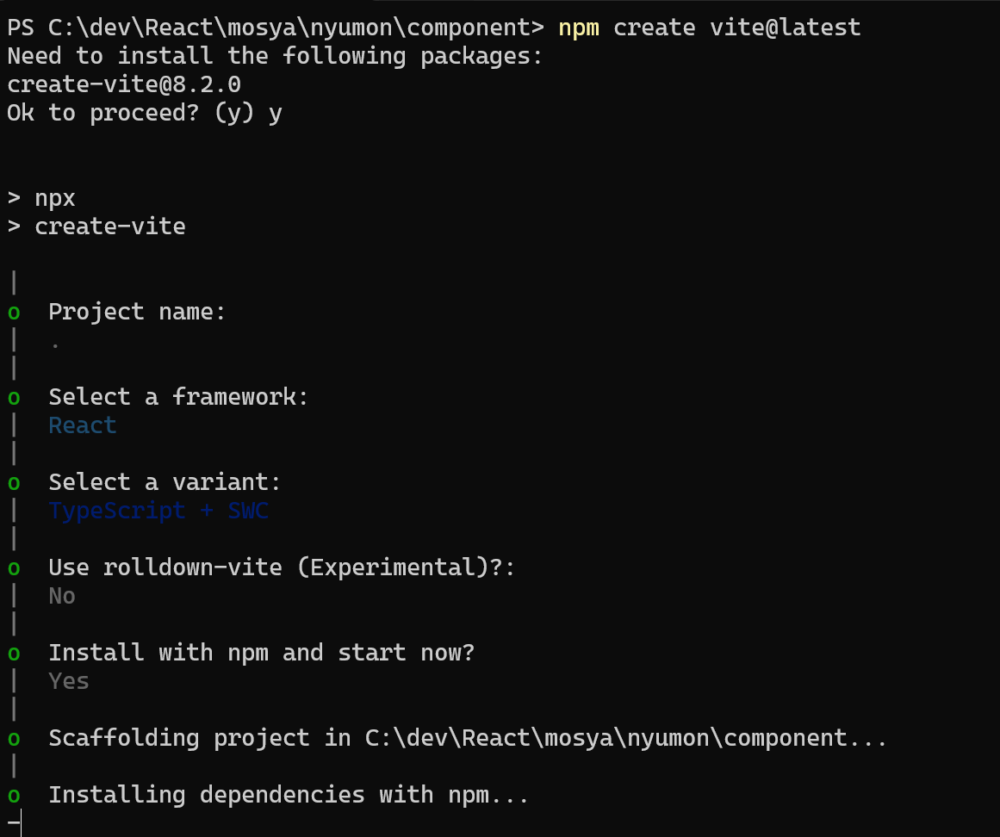

# React の雛形のプロジェクトの作成

create-react-app が非推奨となり、vite で作成することが推奨となった
従来 npx create-react-app?

## vite による React の導入

Vite | 次世代フロントエンドツール

1. 事前に、Node.js と npm をインストール
2. ターミナルから、好きな場所にプロジェクトディレクトリを作成し、移動
3. vite を使用して React プロジェクトを作成します：

```
mkdir 自分のプロジェクト名
cd 自分のプロジェクト名
npm create vite@latest
```

プロンプトに従って、プロジェクト名を入力し、フレームワークとして React を選択します。
Project name: . ← カレントを表す.とする
フレームワークとして TypeScript + SWC を選択

もしくは、オプションによって直接指定する
npm create vite@latest my-react-app -- --template react-swc
npm create vite@latest . -- --template react-swc



依存関係をインストール

```
npm i
```

開発サーバーを起動し、正常に作成されたことを確認

```
npm run dev
```
