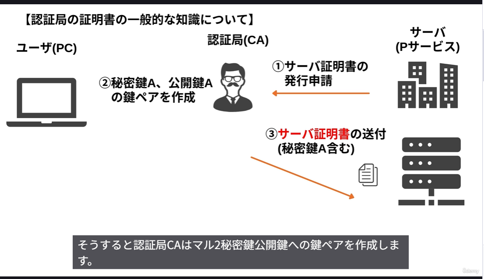
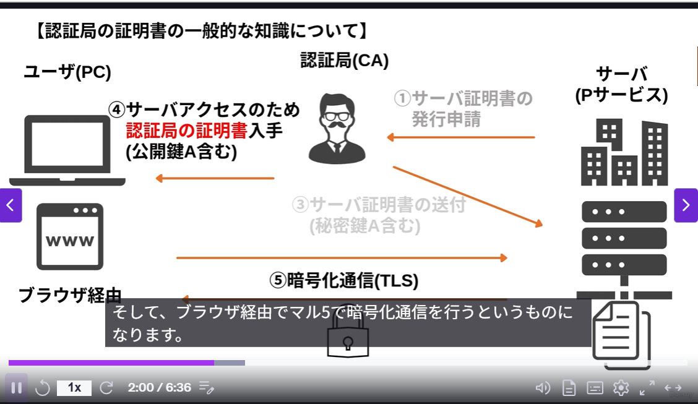
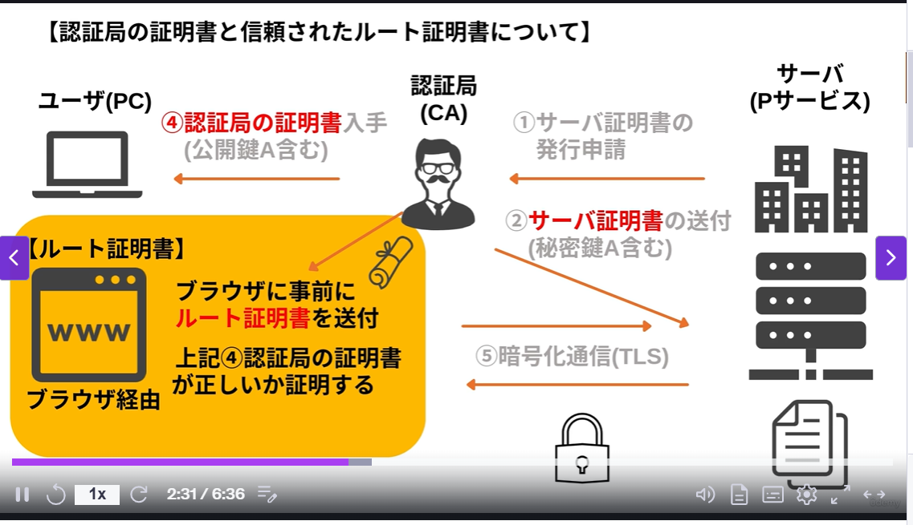

認証局の証明書を証明するのがルート証明書
ルート証明書は、認証局の証明書が正しいことを証明する
ルート証明書は認証局(CA)からブラウザに事前に送付される

# 証明書が違う場合のエラー

１．このサーバ証明書は信頼された認証局から発行されたサーバ証明書でない
２．このサーバ証明書に記載されているサーバ名は、接続先のサーバ名と異なる
３．このサーバ証明書は失効している
４．このサーバ証明書は有効期限が切れている
