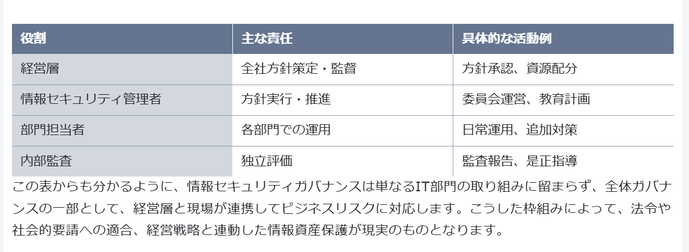

情報セキュリティガバナンスとITガバナンスの相違点

組織構成

具体的な実践例として以下のようなものがあります。

- 新しい基幹システム導入時に事業戦略目標とITの目標が合致しているか経営層が定期レビューする
- ITサービスが障害時にBCP（事業継続計画）が正しく作動するか経営者主導で訓練を実施
- 部門横断的なIT委員会を設置し、技術・セキュリティ・業務各責任者でIT戦略と運用課題を共有
